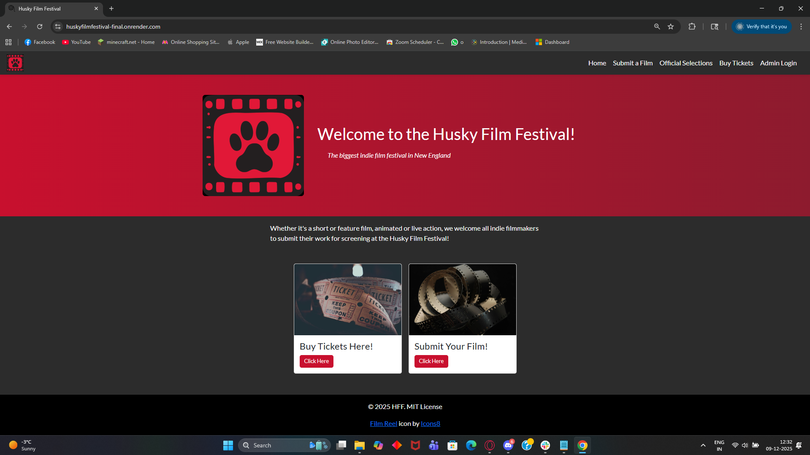
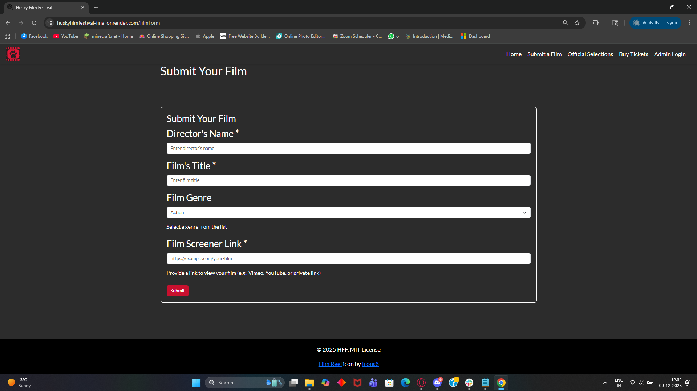
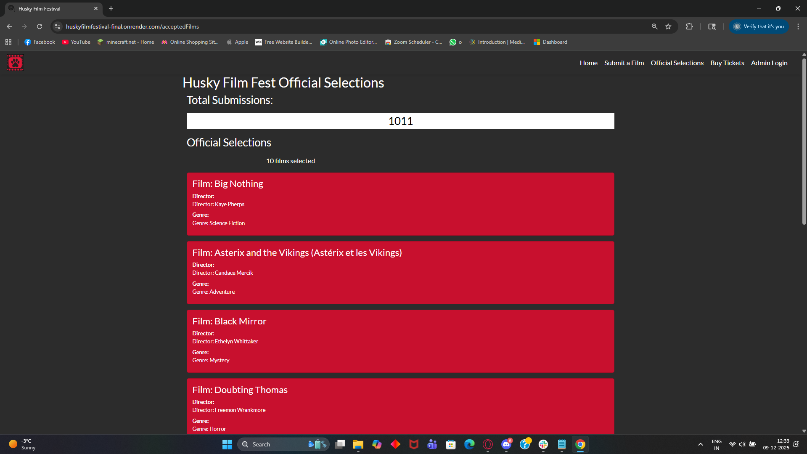
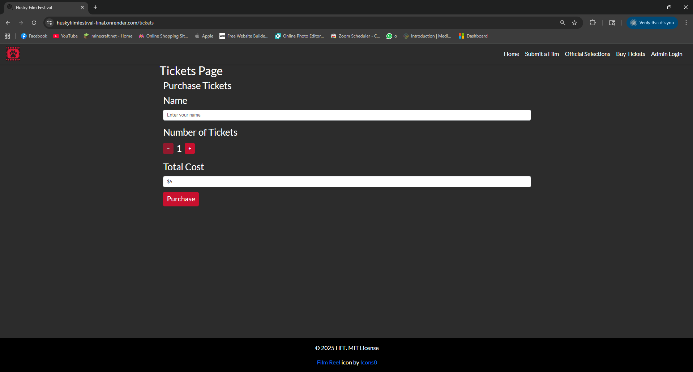
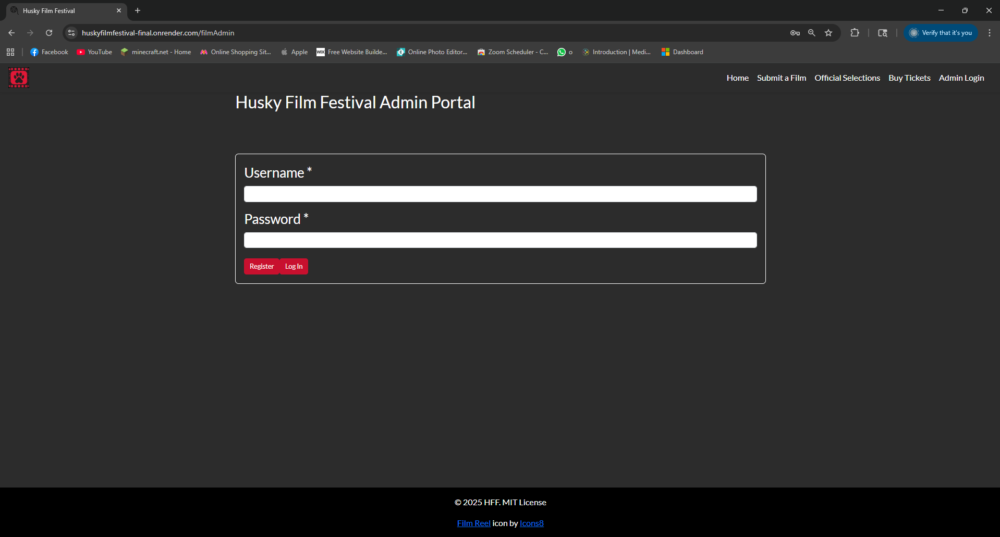
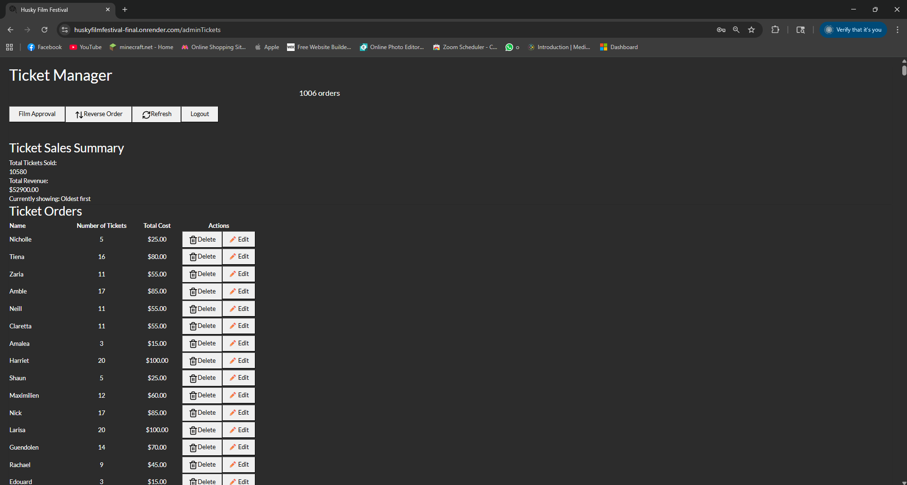
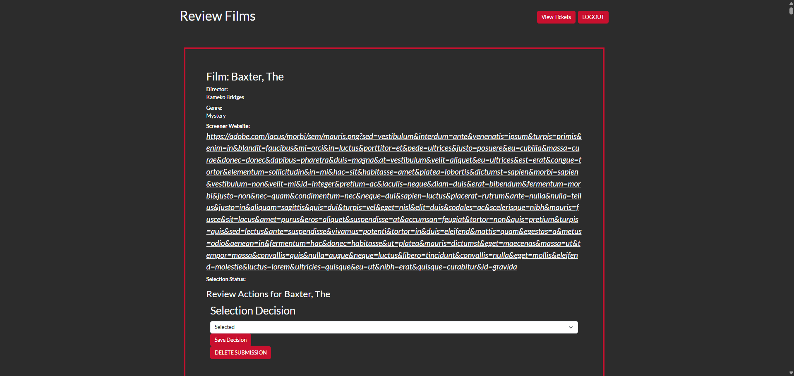

# HuskyFilmFestival

## Authors
Margaret Bertoni, Utkarsh Dev

## Live Website Link:
[Husky Film Fest Website](https://huskyfilmfestival-final.onrender.com/)
## Database Size at Time of Submission:
[MongoDB](frontend/src/assets/images/screenshots/database.png)
## Video Link:
[Video here](https://www.youtube.com/watch?v=KkN8o8clk_M&feature=youtu.be)
## Slides Link:
[Slides here](https://docs.google.com/presentation/d/1Ym8JNJRO0zBd7KrzLFvZcp5GKmMEthf_IH65ekwuc0Q/edit?usp=sharing)
## Design Doc:
[Design Doc](DesignDoc.pdf)
## Class Link
[WebDev Class](https://johnguerra.co/classes/webDevelopment_online_fall_2025/)

## Project Objective
HuskyFilmFestival is a full-stack web application that allows filmmakers to submit their films for screening consideration and enables users to purchase tickets for the festival. Built with React, Node.js, Express, and MongoDB, the platform provides a seamless experience for both creators and attendees.

An admin dashboard allows authorized users to log in, review submissions, and manage customer purchases, including editing or deleting records as needed. The project showcases a complete integration of front-end and back-end technologies to create a dynamic, responsive, and secure event management platform.

## Screenshots

### Home Page

### Film Submission Form

On the "Submit a Film" tab, submit your film for consideration.
### Official Selections Page

On the "Official Selections" tab, see what films have been accepted.
### Ticket Form

Buy a ticket here.
###Admin Login

Admin login page.
### Admin Ticket Management

Admin can edit or delete ticket purchases here, and view total revenue.
### Review films page

Admin cam review and approve films for screen, edit or delete entries.

## Instructions for Admin Mode
1. Go to Admin Login from the Navbar.
2. You will be redirected to the admin login page.
3. Type your credentials and register them, then you can login with the same credentials.
4. Once you login, you'll be redirected to the Review film page, where you can approve the films for screening. Using a button on top you can go to the ticket list where you can see the total revenue, no. of tickets, and can edit or delete entries
5. There is a refresh button to reload the data, and logout button to logout.

## Tools used
- React (frontend) 
- Node.js (backend)
- Express (server)
- MongoDB (database)
- nodemon (dev)
- ESLint, Prettier (code quality/formatting)
- React-Bootstrap (styling)

## Project Structure
- backend.js                 - main Express server (entry)
- package.json               - project metadata & scripts
- node_modules/              - installed packages
- public/ or client/         - frontend assets (Created by React)
- screenshots/               
- README.md                  

## Instructions to build (Locally)=
Prerequisites:
- Node.js (v18+ recommended)
- npm
- MongoDB running locally or a cloud URI

1. Clone the repo and open the project folder:
   - git clone <repo-url>
   - cd HuskyFilmFestival

2. Install dependencies:
   - npm install

3. Configure environment:
   - Create a MongoDB DB and 2 collections (Tickets and filmSubmissions). 
   - Create a .env file and Set MONGO_URI to the appropriate connection (e.g. export MONGO_URI="mongodb://localhost:27017/huskyfilm")
   - Upload sample data (data for  linked)

4. Start the backend server (uses nodemon):
   - npm install
   - npm start
   - By default this runs nodemon and watches backend.js; visit http://localhost:3000 (or the port your backend uses).

5. Frontend :
   - cd frontend
   - npm install

   - For production build: npm run build (then serve the build folder with a static server)
   - For dev build: npm run dev

Notes:
- If your server uses a different port or script, update the commands accordingly.
- Ensure MongoDB is reachable using the MONGO_URI you configured.

## Redesigning
The app has went through major redesigning in order to make it more usable, readable and accessible. The changes made are listed below:

1. Color pallete
   - In order to keep a more consistent color pallete and keeping with the theme of the website, the colors chosen have been repurposed, along with a new logo that uses this new color pallete. Since the app is about a Film Festival at Northeastern, we decided to use the same color pallete as the northeastern website, which can be found here. https://brand.northeastern.edu/design-and-experiences/color/. This color pallete has been used throughout the webpage.

2. Typography
   - Following NEU's website theme, we used the font "Lato", family sans-serif, as the font style for all places on the website.

3. Admin authentication
   - Passport.js has been used to implement authentication in the website. This allows us to reference a database of admin users to approve authenticaiton rather than have the credentials coded in. A single login page will allow access to both the film approval page and the ticket admin page.
  
4. Accessibility
   - All pages, forms and components have now added accessibility, following the WCAG guidelines. The whole website has been made keyboard accessible, HTML semantic tags have been used, aria-labels have been added and alt-text has been added to images. A lighthouse score of 100 in accessibility has been achived for all pages.

## AI Usage
This README was created/edited with assistance from GitHub Copilot (GPT-5 mini). 

GitHub Copilot was used to help troubleshoot page loading issues (incorrect path configuration) and issues with rendering films - but did not allow it to auto generate/change files (GPT-5 mini).

Anthropic's Claude was used to help troubleshoot reloading issues on the Film Review (admin) and Film Submission pages. It was also used to help understand browser error message codes. Claude was used to help troubleshoot during the process of deploying to Render, including understanding Render logs (discovered that there was some file naming issues and an incorrect path). (Sonnet 4.5)

Claude was also used for assisting with adding accessibility to forms, components and pages. (Sonnet 4.5)

The Husky Logo was generated for Project 2 (re-used on the homepage and navbar) and was originally created with Adobe Generative AI.
